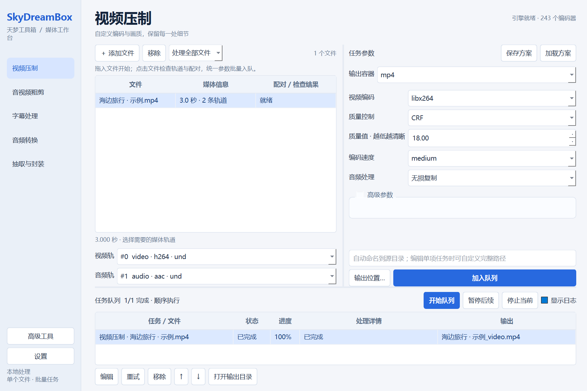
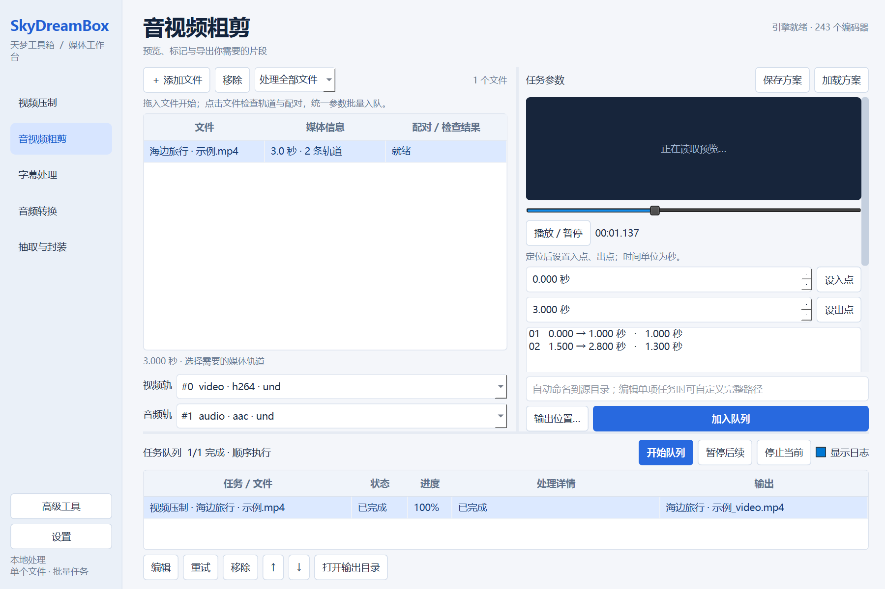

# SkyDreamBox · 天梦工具箱

基于 Python、PySide6 和 FFmpeg 的本地音视频工作台。浅色界面将文件、参数和任务队列放在同一窗口，支持单文件处理和批量任务。



## 主要功能

| 功能 | 支持内容 |
| --- | --- |
| 视频压制 | H.264、H.265、AV1 软件编码；检测 NVIDIA、Intel、AMD 硬件编码；自定义质量、码率、速度、分辨率、帧率、像素格式和色彩参数 |
| 音视频粗剪 | 播放与定位，设置多个片段并排序，分别导出或合并；无损关键帧剪切与重新编码的精确剪切 |
| 字幕处理 | SRT / ASS / SSA；内嵌可开关字幕轨或烧录到画面；同名字幕自动配对、手动修正；SRT 字体、字号及位置 |
| 音频转换 | AAC（`.aac` / `.m4a`）、WAV、FLAC、ALAC（`.m4a`）；选择音轨、采样率、声道和适用位深 |
| 抽取与封装 | MP4 / MKV / FLV 无损换封装，按轨道抽取，组合外部音频；提供 MKA / M4A / AAC / FLAC / WAV / MP3 / MKS 抽取容器 |
| 高级工具 | 保留专业 FFmpeg 命令、图声合成及旧版额外输出格式，统一进入任务队列 |

压制初始值为 libx264、CRF 18、medium，保持原分辨率和帧率，音频默认复制。参数由用户决定，也可保存和加载个人方案。程序不会自动将不可用的编码器替换成其他编码器。

## 运行

需要 Python 3.10+、PySide6 6.6+，以及提供所需编码器的 FFmpeg 和 FFprobe。将两个可执行文件加入 `PATH`，或在应用设置中指定路径。引擎缺失时仍可进入设置修复。

```powershell
pip install -r requirements.txt
python main.py
```

## 操作流程

1. 选择左侧功能，拖入文件或点击“添加文件”（`Ctrl+O`）。
2. 点击文件查看媒体信息、选择轨道。在字幕和封装页逐行检查配对。
3. 设置右侧参数；默认处理全部文件，也可切换“仅处理选中项”。
4. 选择输出位置，点击“加入队列”（`Ctrl+Enter`）。批量输出位置应为目录；单文件可指定完整文件名。
5. 点击“开始队列”。任务逐个执行，失败会显示原因并继续其余任务。双击未完成任务可修改参数。

输出默认位于源目录，附加功能后缀，遇到重名自动编号。视频和音频轨按每个文件分别选择；批量参数不会把一个文件的轨道编号隐式应用到其他文件。外部音频配对会添加所选音轨，若要替换原音轨，请取消勾选源音轨。

“暂停后续”保留当前任务继续运行；“停止当前”终止当前任务。重试会从头开始，程序不提供编码断点续传。关闭后保留队列，下次启动保持暂停；异常退出时仍在运行的任务标记为“已中断”。

## 剪切、字幕与无损处理说明



- 无损剪切受关键帧限制，实际切点可能偏离输入时间；精确剪切重新编码，视频中的音频可转为 AAC 或移除。
- 多段合并限同一源文件，按片段列表顺序输出。多文件批量剪切会逐一检查区间是否超过源时长。
- Qt 预览能力取决于平台和已安装的多媒体组件。不支持预览的媒体仍可输入时间并由 FFmpeg 处理。
- MP4 内嵌文本字幕会转换为 `mov_text`，不能完整保留 ASS 样式；MKV 可保留兼容字幕轨。烧录必须重新编码视频，ASS/SSA 使用原有样式。
- 无损封装只复制流；不兼容的容器/编码组合会被拒绝，不会静默转码。FLV 限一条视频轨和一条音频轨。音频或字幕抽取容器不能装入其他类型的流。
- HDR 素材会提示检查像素格式与色彩参数，并要求确认；程序不自动进行 HDR → SDR 色调映射。
- 裸 AAC 等无索引格式的时长可能由 FFprobe 估算，因此进度与预计剩余时间也可能存在误差。

## 配置与输出保护

配置仍保存在 `config/config.json`；应用目录不可写时使用 `%APPDATA%/SkyDreamBox/`。配置版本升级会保留已有引擎路径和覆盖设置，新增个人方案及 `queue.json`。

新安装默认不覆盖已有文件。主要功能和旧版表单任务先写入输出目录中的专属临时目录，全部步骤成功后发布最终文件；失败和取消会清理本次创建的临时内容。覆盖失败时尝试恢复原文件，恢复失败则保留备份并提示位置。异常断电留下的 `.skydreambox-*` 目录不会在重试时重用。

专业命令按用户提供的原始参数执行，可能包含多个输入/输出；其输出与覆盖策略由命令决定。命令通过参数数组运行，不经 shell。运行日志在队列中按需展开，失败原因也会保存到对应任务。

## 开发与验证

```powershell
python -m unittest discover -s tests -v
python tools/capture_workbench.py
python main.py --verify-install dist/source-verification
```

单元测试默认采用无窗口 Qt 平台；FFmpeg 集成测试在临时目录生成素材，检查输出编码、时长、字幕、剪切和媒体包内容。缺少 FFmpeg/FFprobe 时对应测试跳过。

截图与安装检查使用原生 Windows 窗口验证播放、定位、队列和关闭，避免将无窗口平台当作多媒体设备。安装检查使用独立临时配置，不修改个人队列，并写入 `verification.json` 与截图。

代码按职责拆分：

```text
main.py                 应用入口
workbench.py            工作台与用户操作
ui/task_forms.py        参数表单、片段列表与预览
core/models.py          媒体信息、任务、执行计划、输出命名
core/commands.py        独立校验与 FFmpeg 命令构造
core/services.py        异步媒体探测、引擎与硬件检测
core/queue.py           队列、进程、持久化与输出发布
config.py / styles.py   配置迁移与统一主题
ui_tabs.py / ui/        保留的高级工具及兼容界面
tests/                  单元、Qt 与媒体集成回归
diagnostics.py          源码及安装包运行验证
```

`TaskSpec` 保存入队时的参数快照，`CommandPlan` 描述命令步骤与最终输出，界面不再通过控件是否可见来决定主要功能的 FFmpeg 参数。

## Windows 打包

需要 Nuitka、兼容的 C 编译器和 7-Zip；FFmpeg/FFprobe 仍为外部依赖。

```powershell
python build.py
dist/SkyDreamBox/SkyDreamBox.exe --verify-install dist/package-verification
```

构建脚本打包 Qt 平台和多媒体插件，生成独立目录及自解压包。个人配置、媒体样本和 `dist/` 不应提交到仓库。

在本机验证的 Nuitka 2.7.11 工具链上，如果旧版 Dependency Walker 扫描停滞，可安装 `pefile` 后使用 `python build.py --pefile` 切换 DLL 扫描器。

作者：Tensin。项目遵循 GNU GPL v3，详见 [LICENSE](LICENSE)。
